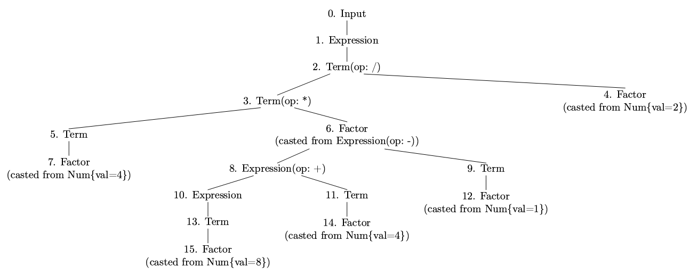

# lab2 实验报告
学号 PB19111692 姓名 袁玉润

## 问题1: cpp 与 .ll 的对应
请说明你的 cpp 代码片段和 .ll 的每个 BasicBlock 的对应关系。

在`.ll`文件中， 每个BasicBlock以标签开头/在函数体首行，以`ret`或`br`语句结束。在`cpp`文件中类似，每个BasicBlock均使用`BasicBlock::create()`函数显式创造，并使用语句`build->set_insert_point()`生成对应`.ll`文件中的label标签、确定后续语句与label标签的位置关系等；在插入新的基本块初始点时，上一基本块生成的IR指令也必须以`br`/`ret`结束。**`.ll`中的每个BasicBlock与`.cpp`中定义的`BasicBlock`对象一一对应**。在跳转语句`br`中，`br`接受参数label，而`cpp`中`build->create_cond_br()`/`build->cread_br()`接受`BasicBlock`对象为参数，其效果一致。

1. `assign`

   在`.cpp`文件中使用`auto bb = BasicBlock::create(module, "entry", mainFun);`显式定义基本块，使用`builder->set_insert_point(bb);`生成label标签。在`.ll`文件中对应`label_entry`标签，到`ret`语句结束。

2. `if`

   在`.cpp`文件中使用`BasicBlock::create`函数定义了`entry`, `trueBB`, `falseBB` 3个基本块，在`.ll`文件中对应`label_entry`, `label_trueBB`, `label_falseBB`标签。

3. `fun`

   两个函数各有一个基本块，均叫做`label_entry`. 

4. `while`

   含有4个基本块：`entry`, `loopEntry`, `trueBB`, `falseBB`, 分别是`while`语句之前的基本块，`while`条件判断块，`while`循环体块和`while`语句之后的基本块。在`.cpp`中使用`BasicBlock::create`分别定义。

## 问题2: Visitor Pattern
分析 `calc` 程序在输入为 `4 * (8 + 4 - 1) / 2` 时的行为：
1. 请画出该表达式对应的抽象语法树（使用 `calc_ast.hpp` 中的 `CalcAST*` 类型和在该类型中存储的值来表示），并给节点使用数字编号。
   

   注：

   1. 标注数字序号的节点标示一个`CalcASTNode`（或其子类）的实例
   2. 使用括号标注的键值对为结点的成员及其数值。

2. 请指出示例代码在用访问者模式遍历该语法树时的遍历顺序。

   序列请按如下格式指明（序号为问题 2.1 中的编号）：  
   3->2->5->1

   先序遍历

   ```
   0->
   1->
   2->
   	3->
   		5->
   			7->
   		6->
   			8->
   				10->
   					13->
   						15->
   				11->
   					14->
   			9->
   				12->
   	4
   ```

## 问题3: getelementptr
请给出 `IR.md` 中提到的两种 getelementptr 用法的区别,并稍加解释:
  - `%2 = getelementptr [10 x i32], [10 x i32]* %1, i32 0, i32 %0`
  - `%2 = getelementptr i32, i32* %1, i32 %0`

在第一条IR指令中，`%1`的类型为`[10 x i32]*`，使用第一组`<type, index>`计算得到`%1+0*sizeof([10 x i32])`，类型为`[10 x i32]*`。使用第二组`<type, index>`在第一步结果基础上偏移`(%0)*sizeof(i32)`，`%2`的类型为`i32*`。

在第二条IR指令中，`%1`的类型为`i32*`。`i32 %0`表示在`%1`的基础上偏移`(%0)*sizeof(i32)`，`%2`的类型为`i32*`。

## 实验难点
描述在实验中遇到的问题、分析和解决方案。

1. 在实验步骤1.3.if_hand.ll中，浮点型常量5.555使用float标准无法精确表示，在IR指令中需要手动转成16进制字面量，这个过程比较麻烦。

   在官方文档[相关部分](https://llvm.org/docs/LangRef.html#:~:text=Floating-point%20constants%20use,a%20floating-point%20type.)提到：

   > Floating-point constants use standard decimal notation (e.g. 123.421), exponential notation (e.g. 1.23421e+2), or a more precise hexadecimal notation (see below). The assembler requires the exact decimal value of a floating-point constant. For example, the assembler accepts 1.25 but rejects 1.3 because 1.3 is a repeating decimal in binary. Floating-point constants must have a [floating-point](https://llvm.org/docs/LangRef.html#t-floating) type.

   因此，为在IR文件中使用字面量，需将5.555转化为可表示的最接近的浮点数，使用IEEE 754标准表示，后用16进制字面值在代码中输入。

   值得注意的是，虽然`float`在IR中为32位（可见官方文档[这里](https://llvm.org/docs/LangRef.html#:~:text=32-bit%20floating-point%20value)），但依据[对常量的描述](https://llvm.org/docs/LangRef.html#:~:text=When%20using%20the%20hexadecimal%20form%2C%20constants%20of%20types%20bfloat%2C%20half%2C%20float%2C%20and%20double%20are%20represented%20using%20the%2016-digit%20form%20shown%20above%20(which%20matches%20the%20IEEE754%20representation%20for%20double))：

   > When using the hexadecimal form, constants of types bfloat, half, float, and double are represented using the 16-digit form shown above (which matches the IEEE754 representation for double);

   **我们应按照`double`的格式转化5.555**. 
   $$
   \begin{align}
   5.555&=(101.100011100001010001111...)_2\\
   &=(1.01100011100001010001111...)_2\times 2^{2}\\
   &=(1.01100011100001010001111...)_2\times 2^{1025-1023}\\
   &=(1.01100011100001010001111...)_2\times 2^{(10000000001)_2-1023}
   \end{align}
   $$
   按照`double`的格式：

   
   $$
   \begin{align}
   \text{sign}&=0\\
   \text{exponent}&=10000000001\\
   \text{mantissa}&=01100011100001010001111\\
   \text{LiteralConstant}&=0,10000000001,0110001110000101000111100000000000000000000000000000
   \end{align}
   $$
   转化为16进制，即`0x40163851E0000000`. 

2. 在阅读`calc_ast.cpp/hpp`时，类之间的继承关系复杂。

   在通过Parsing tree构造AST时，需要注意到`Factor`节点在AST中无直接对应节点，而是直接连接其生成的`Expresion`或`Num`. 

3. 在理解`calc_build.cpp`时，被`visit`与`accept`函数关系困扰。`visit`与`accept`相互调用，深感调用关系复杂。

## 实验反馈
吐槽?建议?
